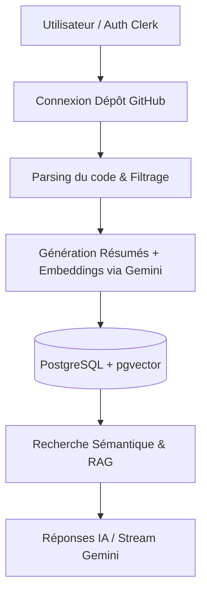

# 🧠 RepoBrain


---

## 📌 Description

**RepoBrain** est une application web d'assistance au développement propulsée par l'IA. Elle transforme n'importe quel dépôt GitHub en une **base de connaissances interactive et interrogeable**.

Elle permet aux équipes de dev de comprendre rapidement un projet complexe, de suivre l'activité des commits en temps réel et d'extraire automatiquement des tâches à partir de réunions audio/vidéo.

---

## ✨ Fonctionnalités principales

- 🔗 **Connexion GitHub rapide** : Importation de dépôts publics ou privés (avec jeton d'accès).
- 🤖 **Compréhension du code par IA** : Analyse automatique des fichiers, génération de résumés et vectorisation (embeddings) pour la recherche sémantique.
- 💬 **Questions / Réponses contextuelles** : Posez une question sur le projet, Gemini recherche les fichiers pertinents et génère une réponse précise en streaming avec références au code source.
- 📝 **Suivi intelligent des commits** : Détection des nouveaux commits et génération automatique de résumés synthétiques des _diffs_.
- 🎙️ **Analyse de réunions (Audio/Vidéo)** : Transcription via AssemblyAI, découpage en chapitres et extraction automatique des tickets/problèmes à traiter.
- 👥 **Collaboration d'équipe** : Gestion multi-utilisateurs, invitations et accès partagés par projet.
- 💳 **Système de crédits & Facturation** : Estimation du coût d'indexation selon la taille du dépôt et rechargement de crédits via Stripe.

---

## 🧰 Stack Technique

| Catégorie                  | Technologies utilisées                                                                                                                                                                                                                                                                                                                                                                                                                                               |
| :------------------------- | :------------------------------------------------------------------------------------------------------------------------------------------------------------------------------------------------------------------------------------------------------------------------------------------------------------------------------------------------------------------------------------------------------------------------------------------------------------------- |
| **Frontend & App**         |      |
| **Base de données & Auth** |                                                                                                         |
| **IA & Intégrations**      |      |

---

## ⚙️ Fonctionnement



1. **Authentification** : Connexion sécurisée via **Clerk**.
2. **Importation** : Saisie de l'URL du dépôt GitHub (les fichiers de _lock_ sont ignorés ; supports de `.ts`, `.py`, `.java`, `.go`, `.rs`, `.cpp`, etc.).
3. **Indexation** : **Gemini** génère un résumé par fichier et crée des vectorisations (embeddings 768d) stockées dans **PostgreSQL (pgvector)**.
4. **Recherche sémantique (RAG)** : Lors d'une question, RepoBrain trouve les fichiers les plus proches vectoriellement et fournit le contexte à Gemini.
5. **Analyse Média** : **AssemblyAI** retranscrit les réunions pour alimenter le gestionnaire d'issues.

---

## 🏗️ Architecture du projet

```text
repobrain/
├── prisma/                 # Schéma PostgreSQL et modèle de données
├── generated/prisma/       # Client Prisma généré
├── public/                 # Ressources statiques
└── src/
    ├── app/                # Pages Next.js (App Router), Layouts et API Routes
    ├── components/ui/      # Composants d'interface réutilisables (Shadcn/ui)
    ├── hooks/              # Hooks React personnalisés (ex: sélection projet)
    ├── lib/                # Connecteurs (GitHub, Gemini, AssemblyAI, Stripe)
    ├── server/api/         # Routeurs tRPC et procédures sécurisées
    ├── styles/             # Styles globaux Tailwind
    └── trpc/               # Configuration client/serveur tRPC
```

---

## 📊 Modèle de données

Les entités clés gérées par **Prisma** :

- 👤 `User` & `UserToProject` : Gestion des utilisateurs et de leurs permissions.
- 📁 `Project` : Informations sur le dépôt GitHub lié.
- 🧬 `SourceCodeEmbedding` : Fichiers sources, résumés et vecteurs associatifs.
- 📜 `Commit` : Historique résumé des modifications du code.
- ❓ `Question` : Historique des requêtes IA et réponses sauvegardées.
- 🎙️ `Meeting` & `Issue` : Transcriptions audio, chapitres et tâches générées.
- 💳 `StripeTransaction` : Suivi des paiements et recharges de crédits.

---

## 🚀 Installation & Démarrage

### Prérequis

- **Node.js** (v18+)
- **npm** ou **pnpm**
- Une base de données **PostgreSQL** avec l'extension `vector` (pgvector) activée.

### Étapes d'installation

1. **Cloner le projet & Installer les dépendances**

   ```bash
   git clone https://github.com/votre-compte/repobrain.git
   cd repobrain
   npm install
   ```

2. **Configurer les variables d'environnement**
   Créez un fichier `.env` à la racine et ajoutez vos clés API (Clerk, Gemini, PostgreSQL, Stripe, AssemblyAI, GitHub).

3. **Synchroniser la base de données**

   ```bash
   npm run db:push
   ```

4. **Lancer l'application en mode développement**
   ```bash
   npm run dev
   ```
   L'application sera accessible sur `http://localhost:3000`.

### 🛠️ Commandes utiles

| Commande            | Description                              |
| :------------------ | :--------------------------------------- |
| `npm run dev`       | Lance le serveur de dev avec Turbopack   |
| `npm run build`     | Compile l'application pour la production |
| `npm run start`     | Démarre l'application compilée           |
| `npm run typecheck` | Vérifie la typification TypeScript       |
| `npm run lint`      | Exécute la vérification ESLint           |
| `npm run db:studio` | Ouvre l'interface GUI Prisma Studio      |

---

## ⚠️ Limitations actuelles

> [!NOTE]
>
> - **Indexation initiale** : L'application limite actuellement l'indexation aux **20 premiers fichiers** du dépôt sur la branche principale `main`.
> - **Base de données** : L'extension `pgvector` est obligatoire sur votre instance PostgreSQL pour exécuter les requêtes de recherche sémantique.

---

## 👨‍💻 Auteur

Développé avec ❤️ par **Votre Nom / Équipe**

📌 **Retrouvez-moi sur :**

- [](https://linkedin.com/in/votre-profil)
- [](https://github.com/votre-compte)

```

### 💡 Qu'est-ce qui a changé/amélioré ?
1. **Header visuel** : Ajout d'émojis et de badges interactifs Shields.io aux couleurs des technologies utilisées.
2. **Tableau des Technologies** : Présentation claire et lisible par catégories (Frontend, DB, IA/Services).
3. **Diagramme de flux (Mermaid)** : Ajout d'un schéma rapide expliquant le parcours de la donnée.
4. **Mise en page des commandes** : Utilisation de tableaux Markdown pour rendre la section *Installation* et *Commandes* plus agréables à lire.
5. **Callout d'avertissement** : Utilisation du composant natif GitHub `>[!NOTE]` pour la section des "Limitations".
6. **Section Auteur** : Ajout d'une section finale identique à votre exemple avec vos liens réseaux sociaux.
```
